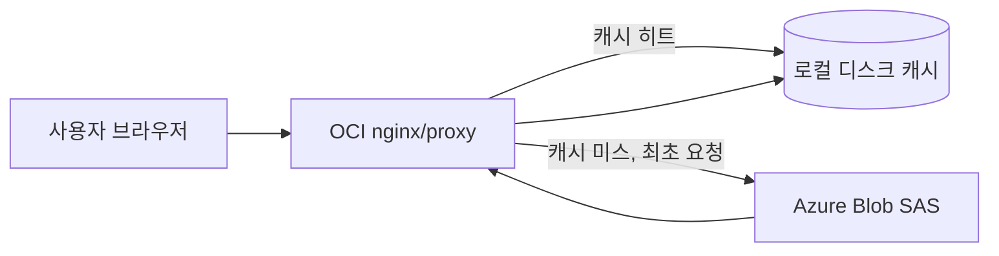
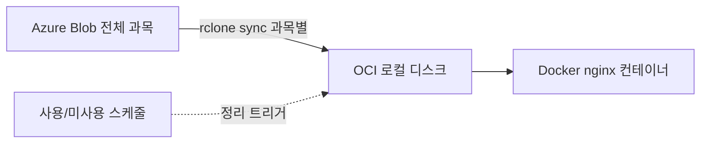

# etextbook-2026 운영 방식 재검토 보고서 (Azure Blob 상시 보관 + OCI On-Demand/과목 단위 복제)

> 2026-08-28 — Azure mesids(구독) 계정 및 OCI mesids 계정 실측 확인 후 작성

## 1. 실측 확인 결과

### 1.1 Azure Blob (`stshareddevforgeprodkrc` / `etextbook-2026` 컨테이너)

| 경로 | 파일 수 | 크기 |
|---|---|---|
| `middle/pe/app` (뷰어+콘텐츠) | 7,265 | ~7.02 GB |
| `middle/pe/bin` | 5 | ~0 |
| `middle/pe/launcher.exe` | 1 | ~2 MB |
| `middle/pe/run` | 127 | ~128 MB |
| `test.txt` | 1 | ~0 |
| **합계** | **7,399** | **~6.99 GB** |

→ **현재 "체육(pe)" 1과목만 업로드 완료된 상태**입니다. 말씀하신 대로 업로드가 끝난 게 아니라, 나머지 과목들이 아직 USB에서 Azure로 올라오지 않은 것으로 확인됩니다. 한 과목당 ~7~10GB 규모이므로, 과목이 늘어날수록 Azure 쪽 용량은 계속 증가하지만 Azure Blob은 사실상 무제한 확장이 가능해 **업로드를 이어가는 것만으로 용량 문제는 해결**됩니다(스토리지 계정 자체에 용량 상한 없음, Student 구독 크레딧만 관리 대상).

### 1.2 OCI mesids 계정 (`onmydoc` 인스턴스, ap-tokyo-1)

| 항목 | 값 |
|---|---|
| Shape | VM.Standard.A1.Flex (ARM64, Always Free) |
| OCPU / RAM | 2 OCPU / 12 GB |
| 상태 | RUNNING |
| 부트 볼륨 | 45 GB (사용 2.2GB, **가용 42GB**) |
| Docker | **설치되어 있지 않음** |
| `/data` 등 콘텐츠 마운트 | 없음 (아직 아무 배포도 안 된 초기 상태) |

→ 이전에 논의했던 "OCI 200GB"는 Always Free 티어의 **블록 볼륨 총 할당량**(테넌시 전체 기준)이며, 현재 `onmydoc` 인스턴스에는 **부트 볼륨 45GB만 붙어 있고 별도 블록 볼륨은 아직 생성/부착되지 않았습니다.** 즉 지금 상태로는 42GB가 실질 가용 용량이며, 과목이 4~5개만 쌓여도(7~10GB×4~5) 부트 볼륨이 꽉 찹니다. **본격 운영 전에 별도 블록 볼륨(최대 ~155GB 추가 가능, Always Free 한도 내)을 생성해 붙이는 작업이 선행되어야 합니다.**

## 2. 운영 방식 재설계 — "Azure 상시 보관 + OCI는 캐시/복제 계층"

말씀하신 방향(Azure Blob = 영구 원본 보관소, OCI = 요청 시 호출 또는 과목 단위(~10GB) 복제)은 이전에 검토했던 "부분 캐시" 전략과 같은 방향이며, 두 가지 구현 방식으로 나눌 수 있습니다.

### 방식 A. 사용자 요청 시마다 Azure에서 직접 불러오기 (On-Demand Fetch / Lazy Cache)

- 사용자가 특정 과목/lesson 리소스를 요청하면, OCI의 프록시(nginx `proxy_cache` 또는 경량 파이썬 캐싱 프록시)가 **로컬 캐시에 없으면 Azure Blob에서 그 파일만 즉시 가져와 응답과 동시에 로컬에 저장**하고, 이후 같은 파일 요청은 로컬 캐시에서 바로 서빙합니다.
- 장점: OCI 로컬 디스크에는 **실제로 열람된 콘텐츠만** 쌓이므로, 42GB(또는 확장된 블록 볼륨)를 거의 초과하지 않음. 과목이 몇 개든 Azure에만 다 올려두면 되고 OCI 용량 걱정이 구조적으로 사라짐.
- 단점: 최초 열람 시(캐시 미스) Azure 응답 대기 시간이 추가됨(동영상 등 큰 파일은 초기 로딩 지연 가능). Azure 이그레스(egress) 트래픽 비용이 열람량에 비례해 발생(Student 크레딧 소모 요인).
- 구현 방법: nginx `proxy_pass` + `proxy_cache_path` (디스크 캐시, `max_size=35g` 등으로 상한 설정 시 LRU 자동 정리) 조합이 가장 간단하고 안정적입니다. Azure 쪽은 컨테이너 단위 **읽기 전용 SAS**를 nginx 설정에 박아두면 됩니다.

### 방식 B. 과목(USB) 단위 복제 (Subject-level Replication, ~10GB 단위)

- 과목 폴더(예: `middle/pe`, `middle/math` …) 단위로 `rclone sync`를 실행해, **현재 서비스 대상 과목만** OCI 로컬 볼륨으로 복제합니다.
- 장점: 한 번 복제되면 완전히 로컬 파일이라 열람 속도가 가장 빠르고 안정적(네트워크 순단 영향 없음). 동영상 스트리밍처럼 큰 리소스가 많은 콘텐츠에 특히 유리.
- 단점: 과목 수가 늘면 결국 로컬 디스크도 그만큼 필요 — "10GB × N과목"이 42GB(혹은 확장 후 용량)를 넘지 않도록 **사용 중이지 않은 과목은 주기적으로 로컬에서 제거**하는 관리가 필요.
- 구현 방법: 과목별 cron 또는 관리 스크립트로 `rclone sync <Azure과목경로> /data/etextbook/<과목> --transfers 4`, 반대로 서비스 종료된 과목은 `rclone purge` 등으로 로컬에서만 삭제(Azure 원본은 그대로 유지).

### 권장 — 하이브리드(A 기본 + B 보조)

1. **기본은 방식 A(On-Demand 캐시)** 로 구성합니다. 모든 과목을 Azure에만 올려두고, OCI는 nginx `proxy_cache`로 "열람된 파일만" 캐시. 디스크 상한(`max_size`)을 블록 볼륨 용량의 80% 정도로 설정해 자동 LRU 정리가 되도록 함.
2. **트래픽/속도가 중요한 과목(현재 학기 진행 중인 과목 등)은 방식 B로 사전 예열(pre-warm)**: 학기 시작 전에 해당 과목만 `rclone sync`로 미리 복제해두면 방식 A의 "최초 요청 지연"을 없앨 수 있습니다. 이 두 방식은 캐시 디렉터리를 공유하므로 병행 가능합니다(사전 복제 = 캐시를 미리 채워두는 것과 동일한 효과).
3. 두 방식 모두 **Azure Blob 자체는 절대 삭제/이동하지 않고 계속 영구 보관소로만 사용** — "업로드는 이어서 계속, 용량 문제는 Azure에서 해결" 하신 방향과 정확히 일치합니다.

## 3. 실행 전 필요한 선행 작업 (Blocking Items)

| # | 항목 | 현재 상태 | 조치 |
|---|---|---|---|
| 1 | OCI 블록 볼륨 | 부트 볼륨 45GB만 존재(가용 42GB) | Always Free 한도 내 블록 볼륨(예: +100~150GB) 신규 생성 후 `onmydoc`에 부착, `/data`에 마운트 |
| 2 | Docker | 미설치 | `onmydoc`(Ubuntu)에 Docker Engine 설치 |
| 3 | Azure 업로드 | pe 1과목만 완료(~7GB) | 나머지 과목 USB → Azure 업로드 계속 진행 (이전 안내한 AzCopy 방식 유지) |
| 4 | 캐시/복제용 SAS | 미발급 | 컨테이너(`etextbook-2026`) 읽기 전용 SAS 발급, nginx/rclone 설정에 반영 |
| 5 | 접근 제어 | 없음(이전 검토에서도 지적) | 최소 IP allowlist 또는 basic auth 적용 (저작권 콘텐츠이므로 필수 권장) |

## 4. 결론

- 말씀하신 판단이 맞습니다: **업로드는 끝난 게 아니라 "pe" 과목만 올라간 상태**이며, Azure Blob 자체는 용량 제한이 없어 나머지 과목 업로드를 이어가면 용량 문제는 해결됩니다.
- OCI는 "전체 미러링"이 아니라 **① 요청 시 Azure에서 가져와 캐시하는 On-Demand 방식**을 기본으로 하고, **② 특정 과목만 사전에 10GB 단위로 복제(pre-warm)** 하는 방식을 보조로 병행하는 하이브리드 구조를 권장합니다.
- 다만 현재 `onmydoc` 인스턴스는 부트 볼륨 42GB만 가용하고 Docker도 미설치 상태이므로, 본격 서비스 전에 **블록 볼륨 확장 + Docker 설치**가 선행되어야 합니다.

*문서 생성: 2026-08-28 | Azure/OCI mesids 계정 실측 확인 기반*
